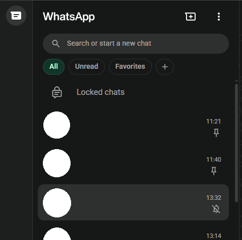
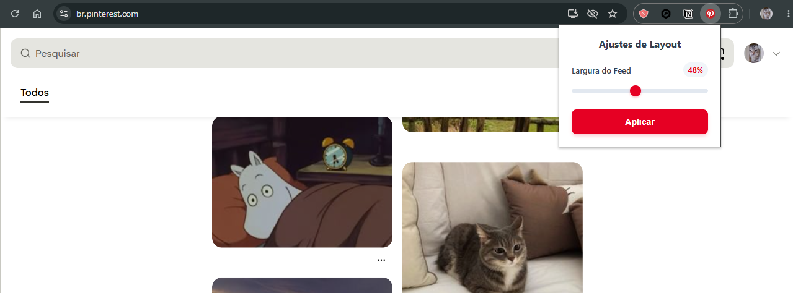

# Chrome Extensions Pack

Coleção de pequenas extensões para o **Google Chrome** que ~~fazem quase nada~~ resolvem incômodos específicos do dia a dia. São simples, leves e focadas em fazer uma única mudança estética que me incomodava.

---

## Instalação

Como as extensões não estão publicadas na Chrome Web Store, a instalação é manual.

1. Abra `chrome://extensions/`
2. Ative o **Modo do desenvolvedor** (Developer mode), no canto superior direito.
3. Clique em **Carregar sem compactação** (*Load unpacked*).
4. Selecione a pasta files da extensão desejada.
5. Pronto! 

---

# Extensões

## 💬 WhatsApp Clean Header

Remove os ícones de **Status**, **Canais** e **Comunidades** da barra lateral do WhatsApp Web.
* Mantém os botões desabilitados para evitar interação.

---

## 📌 Pinterest Feed Width Control

Permite controlar a largura do feed do Pinterest, reduzindo a quantidade de colunas exibidas.
* Ajuste da largura do feed através de um **slider** no popup da extensão.

---
