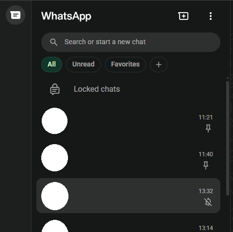
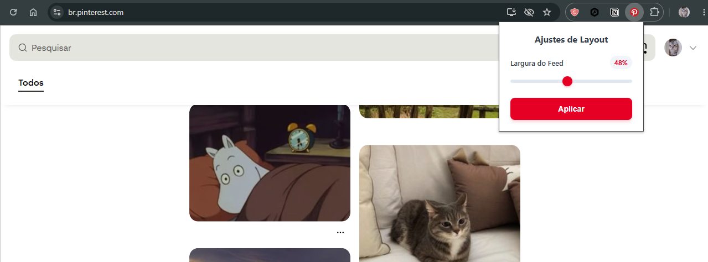
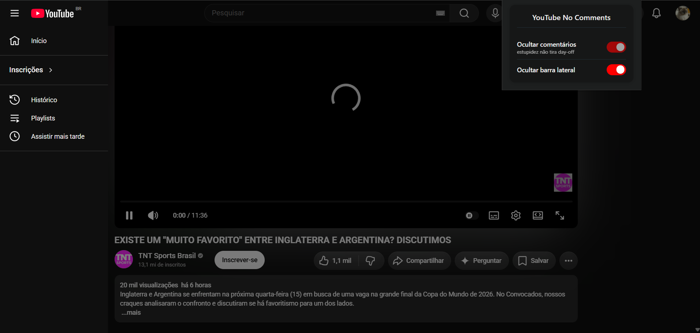

# Chrome Extensions Pack

A collection of small extensions for **Google Chrome** that ~~do almost nothing~~ fix specific everyday annoyances. They're simple, lightweight, and focused on making a single change that used to bother me.

🇧🇷 [Versão em português](README.pt-BR.md)

---

## Installation

Since these extensions aren't published on the Chrome Web Store, installation is manual.

1. Open `chrome://extensions/`
2. Enable **Developer mode**, top right corner.
3. Click **Load unpacked**.
4. Select the `files` folder of the extension you want.
5. Done!

---

# Extensions

## 💬 Minimalist WhatsApp

Lets you hide dozens of WhatsApp Web elements, organized into tabs in the extension popup:
* **Navbar** — Entire header, Calls, Status, Channels, Communities, Divider, Meta AI, Footer icons. Turning on "Entire header" locks and force-hides everything else in this tab.
* **Chatlist** — Drawer title, New chat button, Search bar, Filters, Locked chats, Encryption info, Intro panel.
* **Chats** — Message details, Last message.

The popup language (English/Portuguese) is detected automatically from your browser.

---

## 📌 Pinterest Feed Width Control

Lets you control the width of the Pinterest feed, reducing the number of columns shown.
* Adjust the feed width with a **slider** in the extension popup.

---

## 🤫 Youtube No Comments

Permanently hides comments on every YouTube video. As a bonus, it removes every sidebar item except **Home**, **Subscriptions**, **History**, **Playlists**, and **Watch later**.

---
